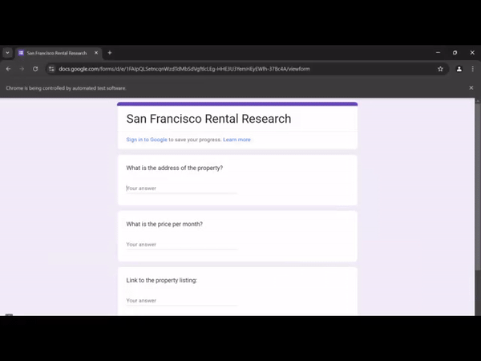

# 🏠 Zillow Clone Scraper and Google Form Automation

This project scrapes real estate listing data (addresses, prices, and links) from a Zillow-clone website and automates the process of submitting the data into a Google Form using **BeautifulSoup** and **Selenium**.

---

## 🚀 **Project Overview**

The script performs the following tasks:

1. Scrapes **property addresses**, **prices**, and **links** from the Zillow-clone website.
2. Automates filling and submitting the extracted data into a Google Form.

---

## 🛠️ **Technologies Used**

- **Python 3.11+**
- **BeautifulSoup**: For web scraping.
- **Selenium**: For browser automation.
- **Google ChromeDriver**: For controlling the Chrome browser.
