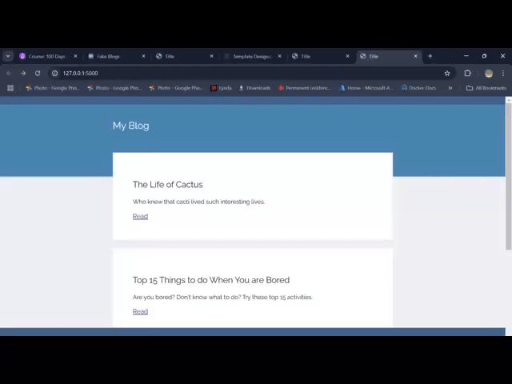

# Blog Website using Flask and Jinja

## Overview
This project is a simple blog website built with **Flask** and **Jinja** templating. It demonstrates the usage of Flask for web development, Jinja for dynamic HTML rendering, and other basic concepts like routing, templates, and handling form data.

## Features
- **Home Page**: Displays a list of blog posts.
- **Post Detail**: Displays individual blog posts with details.
- **Dynamic Rendering**: Uses **Jinja** templating to render HTML dynamically with data passed from Flask.

## Technologies Used
- **Python**
- **Flask**: A micro web framework for Python.
- **Jinja**: Template engine for rendering dynamic HTML.
- **HTML/CSS**: Basic structure and styling of the website.

## Demo Video

