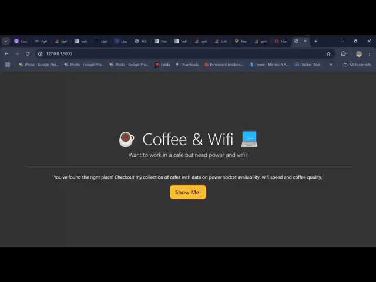

# Coffee and Wifi Project

This project demonstrates the use of Flask, WTForms, Bootstrap-Flask, and CSV manipulation to create a web application that displays a list of cafes and allows adding new entries through a form.

## Demo Video

## Project Features

1. **Home Page**:
   - Styled with `css/styles.css` and Bootstrap.
   - Contains a "Show Me!" button that navigates to the cafes list page.

2. **Cafes List Page**:
   - Accessible at `/cafes`.
   - Displays a table with data from `cafe-data.csv`.
   - Location URLs in the table are rendered as clickable "Maps Link" anchor tags.

3. **Add Cafe Form**:
   - Secret route `/add` accessible to users who know the path.
   - Uses WTForms and Bootstrap-Flask to render a form with the following fields:
     - Cafe Name
     - Location URL
     - Opening Time
     - Closing Time
     - Coffee Rating
     - Wifi Strength Rating
     - Power Socket Availability
   - Location URL field includes validation to ensure the entered data is a valid URL.
   - Data submitted through the form is appended to `cafe-data.csv`.

## Requirements and Implementation Details

### Front-End:
- **Base Template**: 
  - Contains Bootstrap blocks for consistent styling across pages.
  - Links to `css/styles.css` for additional styling.
- **cafes.html**: 
  - Displays cafe data in a Bootstrap-styled table.
  - Uses the `cafes` object passed from the `/cafes` route to populate the table.
- **add.html**:
  - Contains a form rendered with Flask-WTF and Bootstrap-Flask.

### Back-End:
- **Flask Routes**:
  - `/` - Renders the home page.
  - `/cafes` - Renders the cafes list page.
  - `/add` - Renders the form to add new cafe data.
- **CSV Manipulation**:
  - Data is read from and written to `cafe-data.csv`.
  - New entries are appended to the file in a comma-separated format.

### Validation:
- **URL Validation**:
  - Ensures the location field contains a valid URL.
  - Implemented using WTForms validators.

### Navigation:
- All navigation links are functional and direct users to the correct pages.
