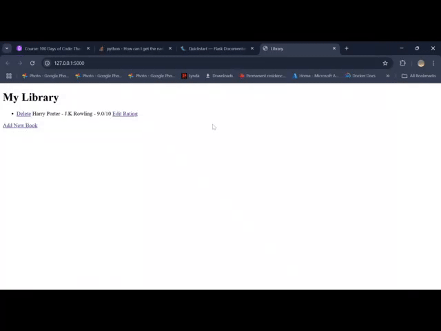

# Library Management System with Flask and SQLAlchemy

This is a simple Flask application to manage a library of books. It allows users to perform CRUD (Create, Read, Update, Delete) operations.

## Features

- **View Books**: See a list of all books in the library.
- **Add a Book**: Add new books to the library with a title, author, and rating.
- **Edit Rating**: Update the rating of an existing book.
- **Delete Book**: Remove a book from the library.

## Technologies Used

- **Python**: Flask for the web framework.
- **SQLAlchemy**: For database modeling and interactions.
- **SQLite**: As the database backend.
- **HTML**: For templates.

## Demo Video

